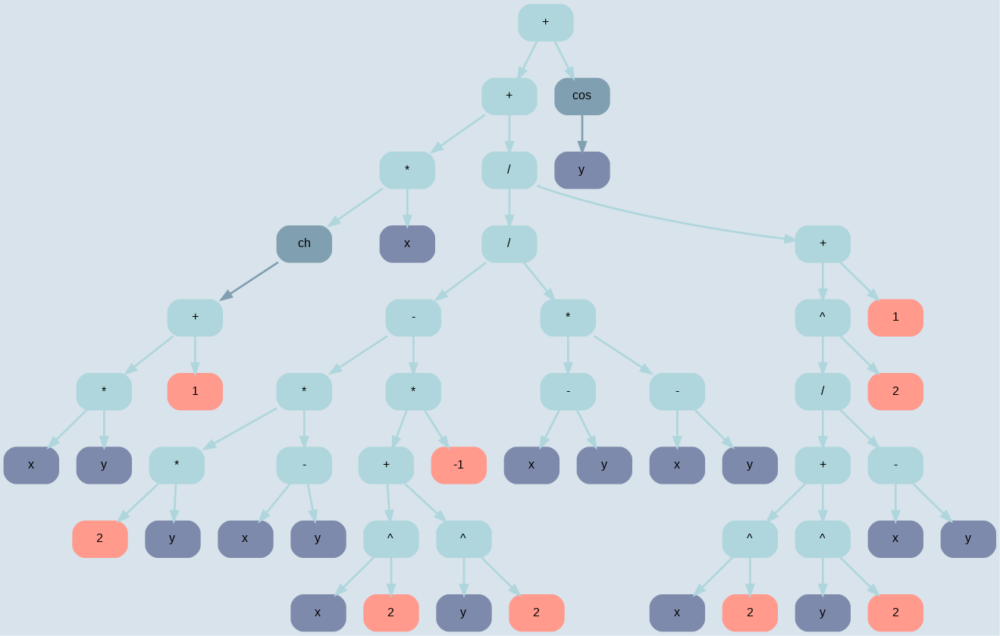

# Differentiator

## Table of Contents
- [Overview](#overview)
- [Features](#features)
- [Usage](#usage)
- [Build and Run](#build-and-run)
- [Example](#example)

## Overview
Differentiator is a C/C++ program that performs symbolic differentiation of mathematical expressions represented as trees. It supports calculation of total differential, partial derivatives and generation of results in LaTeX format.

## Features
- Symbolic differentiation of expressions of any complexity
- Full differential support
- Calculation of partial derivatives
- Generating output in .tex-file with beautiful layout
- Expression tree visualisation via Graphviz
- Expression simplification
- Support for basic operations and elementary functions

## Usage
1. Input data: text file with a mathematical expression
2. Differentiation: the programme calculates the derivative or total differential
3. Visualisation: generation of Graphviz-graphs (optional)
4. Result: output to a .tex file with formulas in LaTeX notation

## Build and Run
To build and run the Differentiator:

```bash
git clone git@github.com:rAch-kaplin/Differentiator.git

make

./do -i expr.txt -o tex_file.tex
```

## Example
The input file is `expr.txt`:

```
sh(x * y + 1) + arctg((x^2 + y^2) / (x - y)) + sin(y)$
```

A tree that can be built using the graphviz library



Example of a report that TeX will generate

[Example PDF output](https://github.com/rAch-kaplin/Differentiator/blob/main/diffenrentiator.pdf)
